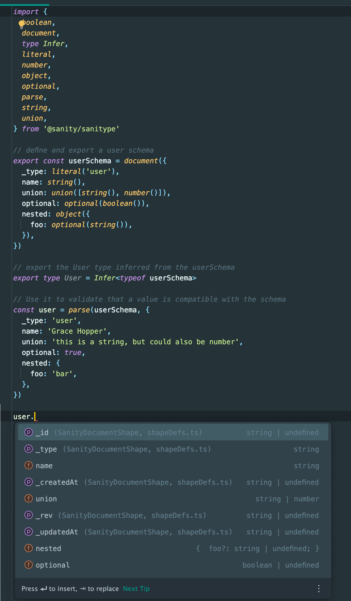

# sani*type*

> Exploration of TypeScript-first Sanity schemas with static type inference and runtime validation

## TL;DR



## How to play around

### 1. Get the code

#### Alternative 1: install from npm
NOTE: It's a private package, so this it requires you to be logged in to npm as a user with access to the @sanity-io organization
```
npm i -S @sanity/sanitype
```
Check out the [examples](./examples) folder for how to use it.

#### Alternative 2: use GitHub Codespaces
[](https://codespaces.new/sanity-io/sanitype)

#### Alternative 3: Clone this repository

```
git clone git@github.com:sanity-io/sanitype.git
```

### 2. Install dependencies

```
npm install
```

Now you can take a look at the examples in the `examples` folder (feel free to create your own example and push to a branch, e.g. to illustrate a bug, lacking feature, or something that's hard to solve with this approach compared to current day schemas)

A simple Studio example can be found in `examples/studio`. Start with:

```
npm run example:studio
```

Also make sure to take a look at the various tests that are colocated with the source code.

## Features

### Developer friendly API

You define your schema using TypeScript, and you'll get type definitions for your sanity documents, plus the added bonus of runtime type checking.

### Extensible

Create base types that can be extended in different contexts. For example: share the schema for user submitted data between your frontend and your Studio.

### End to end type safety with runtime validation

You can use sanitype definitions to validate JSON data coming from the Sanity API or any other external data source.

### Composable

Types can be extended and composed with other types, made partial depending on context.

### Better separation of concerns

Decouples _datamodel_ and _form_. Currently, Sanity Schemas is used for both. This means you can create different editing experiences for on top of the same data model, and your data model can be used in other contexts than the Sanity Studio.

### Everything is immutable

Extending a schema type returns a new and modified schema and never modifies the original one

### Limitations

Static types only works schema generation works as far as TypeScript can infer

For example, if you desire to generate types dynamically like this:

```typescript
const strings = ['firstName', 'lastName']
const shape = {}
strings.forEach(key => {
  shape[key] = z.string()
})

const schema = s.object(shape)

// type of value will be {}
const value = schema.parse({
  firstName: 'Bjørge',
  lastName: 'Næss',
})
```

The inferred static type here will be limited to `{}` (note: the parser will still work as expected)

To reap the full benefit of static typing, it's recommended to write your schemas in a way that TypeScript can infer as narrow types as possible, e.g.:

```typescript
const shape = {
  firstName: string(),
  lastName: string(),
}
const schema = object(shape)

// inferred type of value will be {firstName: string, lastName: string}
const value = parse(schema, {
  firstName: 'Bjørge',
  lastName: 'Næss',
})
```

# Todo

## Schema types

- [x] primitive types
- [x] literal type
- [x] document
- [x] reference
- [x] object
- [x] array (of both primitives and objects and unions of either primitives or typed objects)
- [x] union
- [x] recursive types
- [ ] image
- [ ] file
- [ ] date + datetime
- [ ] other string derivatives: text, email, url (probably best solved by [_refinement_](https://zod.dev/?id=refine))
- [ ] block array / portable text

## Schema type features

- [ ] **Parse error formatters**:
      Parse errors are currently represented as a data structure containing array of node paths and errors - there should be some basic utils for formatting these nicely
  - [ ] Terminal (optionally w/colors)
  - [ ] React
  - [ ] Plain HTML
- [ ] Life cycle augmentations

  - [ ] New
  - [ ] Draft
  - [ ] Published

- [ ] **Serializer (maybe even deserializer)**
  - Serialize TS schema to JSON (easy except for lazy/recursive types), potentially also from JSON to TS schemas too (this might be pretty tricky!)
-
- [ ] **Validation**
      A lot of validation is taken care of by the type system already, but we still need things like:
  - [ ] numbers min/max, decimals, etc
  - [ ] string: max/min length, regex, etc.
  - [ ] array: min, max entries
        In addition, validation needs the following
  - [ ] custom validation rules with custom messages (or i18n-keys)
- [ ] Transformations
- [ ] Refinements
- [ ] Partial / deep partial and required/deep required objects
- [ ] Async validations (or perhaps these could be modelled separately as more of "linter" style checks, that can also provide autofix features)

## Forms

Forms need to have the same feature set as current sanity schemas (although without the type aspect)

- [ ] Initial values
- [ ] Conditional fields
- [ ] Field groups
- [ ] Components maps (field, input)

## Compatibility layer

- [x] [partially done] implement a function taking a new schema + form as input and convert it to a sanity schema compatible with v3
- [ ] Codemod/migrator from v3 style schema to ts-first schema + form definition

# Open questions

1. Should schema types allow for _some_ degree of metadata? E.g. feels like it should at least support a general `description`. Although, this metadata should probably be seen as more like metadata about the _data model_ itself, rather than something to guide the editor when doing data entry. Alternatively, metadata could be provided in the form of code comments/tsdocs, but that requires more effort to extract.
2. No builder pattern? Currently, this implementation uses creator functions that returns plain JavaScript values. This is design choice appears to be in line with general industry trends, but is different from e.g. zod, which uses a builder pattern. The advantage if builder pattern is that you can pass the schema type around, and start calling methods on it. With a creator pattern, you'll have to import the methods and call them by passing the schema type to it. E.g. builder pattern: `movie.parse(json)`, creator pattern: `parse(movie, json)`. Note: it should be fairly straightforward to implement an api providing the builder pattern on top of the creator functions if we want to.
3. Do we still need schema-level runtime checks for developers using plain JS? I think yes, also because TS errors can be hard to comprehend, so being able to validate the schema runtime and give helpful errors in a UI. Also: we probably want to warn about common pitfalls.

### Acknowledgements

This implementation is heavily inspired by zod, which popularized runtime schemas with static type inference.

### Why not just use Zod?

There's several advantages of building our own:

#### We can build sanity-isms into it

Sanity is opinionated about a great deal of your data model, for example

1. Object types automatically gets assigned `_key: string` when they're inside arrays
2. Documents gets assigned a `_rev: string`-property, etc.
3. We can create mappings between various lifecycles of a sanity document (e.g. `const myDraft = asDraft(myDocumentSchema)`):
   1. Draft documents are deeply partial, so each property everywhere must be optional.
   2. Published documents will have better guarantees, so you don't need to null check required properties at all

##### Restrictions

Maybe more important is the _restrictions_ we can build into it

1. Zod has a lot of data types we don't support/care about, like sets, maps, functions, promises etc.
2. We don't support multidimensional arrays, arrays of both primitive values and objects.
3. Object unions is only supported for _typed_ objects (i.e. objects with a `_type` literal). This restriction is necessary in order to support collaborative real-time editing of partial object values. Without a discriminator it would be impossible to tell which schema type a partial (e.g. empty) object belongs to.
4. Fields starting with underscore is reserved for system fields. Sanitype produces a compile-time error if you define a field starting with underscore.
5. There's restrictions on what characters can be used as object properties
6. … and more?

Making our own lets us codify these rules into our schema model and provide developers with compile-time feedback if they try to model something we don't currently support!
